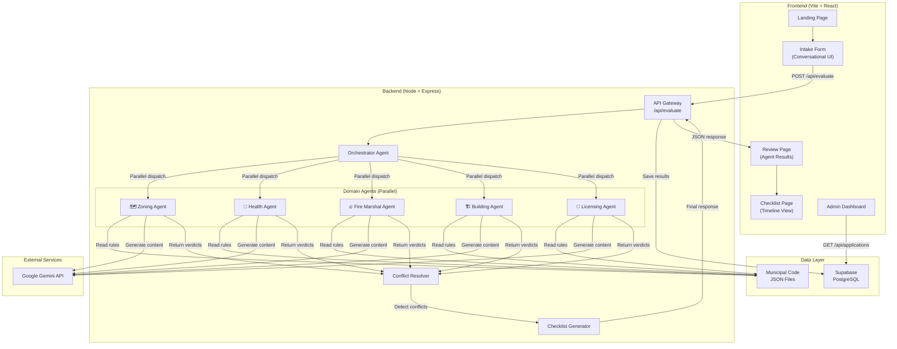
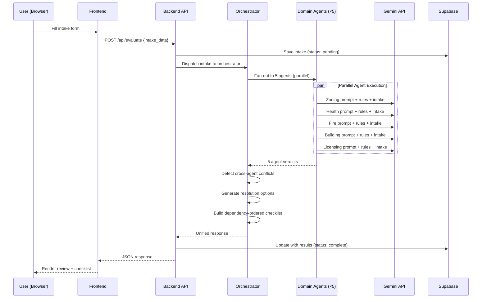
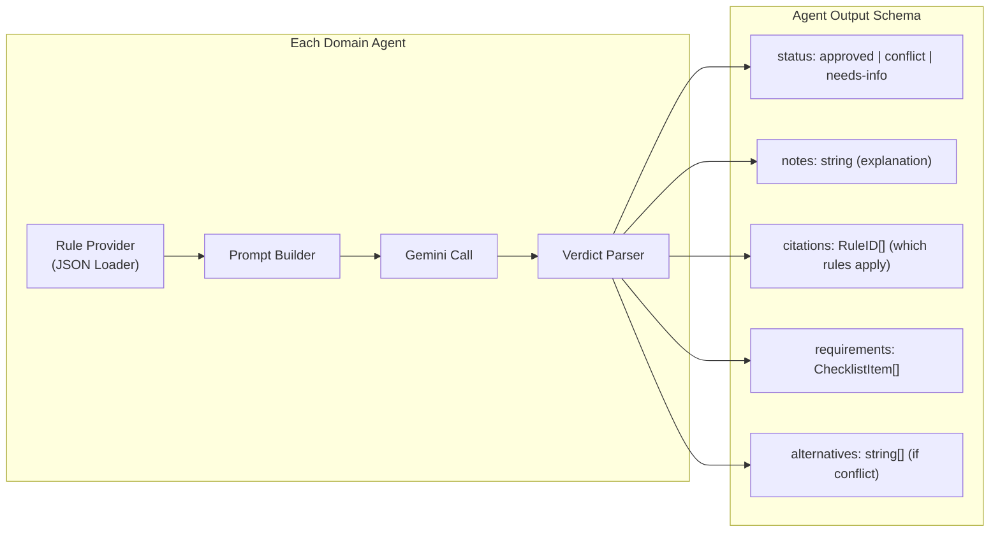

# PermitPilot — Implementation Plan

**From 14 Weeks to 14 Minutes: The AI-Powered Civic Permit Navigator for Local Businesses.**

---

## User Review Required

> [!IMPORTANT]
> **Gemini API Key**: You'll need a Google AI Studio API key (`GEMINI_API_KEY`). The free tier of `gemini-2.0-flash` allows **1,500 requests/day** (300 full 5-agent submissions). Do you want to use `gemini-2.5-flash` (smarter but only 20 req/day free) or `gemini-2.0-flash` (fast, 1500 req/day free)?

> [!IMPORTANT]
> **Database**: I recommend **Supabase** (free tier: 500MB, unlimited API requests) for persisting applications and results. Is this acceptable, or do you prefer a different database (e.g., Firebase, PostgreSQL directly)?

> [!IMPORTANT]
> **Scope of Municipal Data**: For the MVP, I'll create curated JSON files with realistic municipal rules for a target city (e.g., Seattle). This acts as a "pseudo-RAG" system. In Phase 4, we can integrate real municipal code PDFs via Gemini's document understanding. Is this approach acceptable?

> [!IMPORTANT]
> **Deployment Target**: Are you planning to deploy this (Vercel + Railway/Render), or is local-only sufficient for now?

---

## Open Questions

1. **Target City**: Should we model the rules after a specific city (e.g., Seattle, Portland, Austin), or keep them generic?
2. **Authentication**: Do you want user login/signup (e.g., Google OAuth via Supabase Auth), or is this an anonymous, open tool for the MVP?
3. **PDF Pre-filling**: The spec mentions "direct links to pre-filled PDF forms." Should we actually generate filled PDFs (using a library like `pdf-lib`), or just link to the blank forms with instructions?
4. **Admin Dashboard**: Do you want a city-official-facing admin view to see submitted applications and agent results?

---

## Technology Stack

### Frontend
| Technology | Purpose | Why |
|---|---|---|
| **Vite + React 19** | Build tool + UI framework | Instant HMR, lean bundles, ideal for interactive SPA dashboards |
| **TypeScript** | Type safety | Catches bugs early, better DX with AI response types |
| **TanStack Router** | File-based routing | Type-safe routes, built-in loaders, search params |
| **Framer Motion** | Animations | Smooth micro-animations for agent cards, transitions |
| **Tailwind CSS v4** | Styling | Rapid prototyping with utility classes, dark mode built-in |
| **Lucide React** | Icons | Consistent, beautiful icon set for agent badges |
| **Sonner** | Toast notifications | Elegant notifications for errors/successes |

### Backend
| Technology | Purpose | Why |
|---|---|---|
| **Node.js + Express** | API gateway | Lightweight, fast to build, excellent ecosystem |
| **Google Gemini API** (`@google/generative-ai`) | Multi-agent AI | Powers all 5 domain agents + orchestrator |
| **Supabase** (`@supabase/supabase-js`) | Database + Auth | Free tier, real-time subscriptions, row-level security |
| **dotenv** | Environment config | Secure API key management |
| **cors** | Cross-origin | Frontend ↔ Backend communication |

### Data Layer
| Technology | Purpose | Why |
|---|---|---|
| **Curated JSON rule files** | Municipal code representation | Structured, deterministic, no hallucination on rules |
| **Supabase PostgreSQL** | Application persistence | Store intake data + agent results for admin view |

### DevOps & Tooling
| Technology | Purpose |
|---|---|
| **pnpm** | Fast, disk-efficient package manager |
| **ESLint + Prettier** | Code quality |
| **Git** | Version control |

---

## System Architecture

### High-Level Architecture



### Request Flow (Sequence)



### Agent Architecture Detail



---

## Proposed Changes

### Component 1: Project Scaffolding

#### [NEW] Root project structure
```
PermitPilot/
├── backend/
│   ├── index.js              # Express server + orchestrator
│   ├── agents/                # Agent module definitions
│   │   ├── zoning.js
│   │   ├── health.js
│   │   ├── fire.js
│   │   ├── building.js
│   │   └── licensing.js
│   ├── data/                  # Municipal code JSON files
│   │   ├── zoning_code.json
│   │   ├── health_code.json
│   │   ├── fire_code.json
│   │   ├── building_code.json
│   │   └── business_code.json
│   ├── utils/
│   │   ├── gemini.js          # Gemini client singleton
│   │   └── supabase.js        # Supabase client singleton
│   ├── package.json
│   └── .env.example
├── frontend/
│   ├── src/
│   │   ├── routes/
│   │   │   ├── __root.tsx     # Root layout
│   │   │   ├── index.tsx      # Landing page
│   │   │   ├── start.tsx      # Intake form
│   │   │   ├── review.tsx     # Agent results
│   │   │   ├── checklist.tsx  # Timeline checklist
│   │   │   └── admin.tsx      # Admin dashboard
│   │   ├── components/
│   │   │   ├── ui/            # Reusable UI primitives
│   │   │   ├── site-chrome.tsx
│   │   │   ├── agent-card.tsx
│   │   │   ├── conflict-banner.tsx
│   │   │   ├── checklist-timeline.tsx
│   │   │   └── status-badge.tsx
│   │   ├── lib/
│   │   │   ├── api.ts         # Backend API client
│   │   │   └── types.ts       # Shared TypeScript types
│   │   ├── hooks/
│   │   │   └── use-permit.ts  # Permit evaluation hook
│   │   └── styles.css
│   ├── package.json
│   ├── vite.config.ts
│   ├── tailwind.config.ts
│   └── tsconfig.json
├── .env.local
├── .gitignore
└── README.md
```

---

### Component 2: Backend — API Gateway & Orchestrator

#### [NEW] [index.js](file:///c:/Users/ishaa/OneDrive%20-%20UW/Academic/Coding/PermitPilot/backend/index.js)
- Express server with CORS, JSON parsing
- `POST /api/evaluate` — Main endpoint: receives intake, fans out to 5 agents, returns unified result
- `GET /api/health` — Health check
- `GET /api/applications` — Admin: list past applications from Supabase

#### [NEW] [agents/*.js](file:///c:/Users/ishaa/OneDrive%20-%20UW/Academic/Coding/PermitPilot/backend/agents/)
Each agent module exports an `evaluate(intakeData)` function that:
1. Loads its specific rule JSON file
2. Constructs a domain-specific prompt with the rules + intake data
3. Calls Gemini API with structured output instructions
4. Parses the JSON response into a standardized verdict schema

#### [NEW] [utils/gemini.js](file:///c:/Users/ishaa/OneDrive%20-%20UW/Academic/Coding/PermitPilot/backend/utils/gemini.js)
- Initializes `GoogleGenerativeAI` client
- Exports a reusable `generateContent(prompt, systemInstruction)` function
- Handles retries and rate limiting gracefully

#### [NEW] [utils/supabase.js](file:///c:/Users/ishaa/OneDrive%20-%20UW/Academic/Coding/PermitPilot/backend/utils/supabase.js)
- Initializes Supabase client with service role key
- Exports helper functions: `saveApplication()`, `getApplications()`

---

### Component 3: Data Layer — Municipal Code Rules

#### [NEW] [data/zoning_code.json](file:///c:/Users/ishaa/OneDrive%20-%20UW/Academic/Coding/PermitPilot/backend/data/zoning_code.json)
Rules covering: land use districts, setback boundaries, permitted hours of operation, proximity restrictions (parks, schools, residential), signage regulations.

#### [NEW] [data/health_code.json](file:///c:/Users/ishaa/OneDrive%20-%20UW/Academic/Coding/PermitPilot/backend/data/health_code.json)
Rules covering: food prep tiers, gray water tanks, commissary kitchen requirements, restroom access, sanitation equipment, food handler certifications.

#### [NEW] [data/fire_code.json](file:///c:/Users/ishaa/OneDrive%20-%20UW/Academic/Coding/PermitPilot/backend/data/fire_code.json)
Rules covering: propane/LPG tank limits, fire suppression hoods, generator placement, fire extinguisher requirements, emergency exits, ventilation.

#### [NEW] [data/building_code.json](file:///c:/Users/ishaa/OneDrive%20-%20UW/Academic/Coding/PermitPilot/backend/data/building_code.json)
Rules covering: electrical capacity, NEMA shore power, structural modifications, ADA compliance, utility connections, signage mounting.

#### [NEW] [data/business_code.json](file:///c:/Users/ishaa/OneDrive%20-%20UW/Academic/Coding/PermitPilot/backend/data/business_code.json)
Rules covering: business license requirements, workers' compensation, liability insurance minimums, DBA registration, special permits (alcohol, outdoor seating).

---

### Component 4: Frontend — User Interface

#### [NEW] [index.tsx](file:///c:/Users/ishaa/OneDrive%20-%20UW/Academic/Coding/PermitPilot/frontend/src/routes/index.tsx) — Landing Page
- Hero section with gradient background, tagline, CTA button
- "How it Works" section with 3 animated cards (Describe → Negotiate → Execute)
- Agent Council grid showing the 5 agents + orchestrator with icons
- Footer with branding

#### [NEW] [start.tsx](file:///c:/Users/ishaa/OneDrive%20-%20UW/Academic/Coding/PermitPilot/frontend/src/routes/start.tsx) — Conversational Intake
- Step-by-step conversational questionnaire (6 questions):
  1. Business name
  2. Business type (restaurant, retail, food truck, salon, etc.)
  3. Location/zone
  4. Number of employees
  5. Operating hours
  6. Special equipment (propane, grills, generators)
- Real-time agent sidebar: agents "wake up" as relevant questions are answered
- "Skip — use demo" button for quick testing
- Loading state with agent evaluation animation

#### [NEW] [review.tsx](file:///c:/Users/ishaa/OneDrive%20-%20UW/Academic/Coding/PermitPilot/frontend/src/routes/review.tsx) — Agent Results
- Applicant summary header (from intake data)
- 5 agent verdict cards with status badges (approved/conflict/needs-info)
- Expandable details with rule citations
- Conflict banners with resolution alternatives
- Overall status indicator

#### [NEW] [checklist.tsx](file:///c:/Users/ishaa/OneDrive%20-%20UW/Academic/Coding/PermitPilot/frontend/src/routes/checklist.tsx) — Timeline View
- Dependency-ordered permit timeline
- Numbered steps with estimated durations
- Cost estimates per permit/license
- Links to relevant forms
- Print-friendly layout

---

### Component 5: Orchestrator Logic

The orchestrator is the brain that:
1. **Fans out** intake data to all 5 agents in parallel via `Promise.allSettled()`
2. **Collects** all agent verdicts
3. **Detects cross-agent conflicts** — e.g., if Zoning says "approved for park-adjacent operation" but Fire says "propane not allowed within 50ft of park"
4. **Generates resolution options** — e.g., "Switch to electric cooking" or "Move operating zone 50+ feet from park"
5. **Builds a dependency-ordered checklist** — e.g., "Get zoning approval before applying for health permit"
6. **Calculates estimated costs and timeline**

#### Conflict Detection Algorithm
```
For each agent_i verdict:
  For each agent_j verdict (j > i):
    If agent_i.status == "approved" AND agent_j.status == "conflict":
      If overlapping_subject(agent_i, agent_j):
        flag_cross_department_conflict(agent_i, agent_j)
        generate_alternatives(intake_data, conflicting_rules)
```

---

## Implementation Phases

### Phase 1: Foundation (Core Infrastructure)
> **Goal**: Get the skeleton running end-to-end with a single agent.

- [ ] Initialize Vite + React frontend with TanStack Router, Tailwind, TypeScript
- [ ] Initialize Node + Express backend with Gemini SDK
- [ ] Create project structure (folders, configs, .env)
- [ ] Build the landing page with premium design
- [ ] Build the conversational intake form (all 6 questions)
- [ ] Create 1 agent (Zoning) as proof of concept
- [ ] Wire up `POST /api/evaluate` → single agent → response
- [ ] Build basic review page to display single agent result
- [ ] Verify end-to-end flow works

### Phase 2: Multi-Agent System (Core Feature)
> **Goal**: All 5 agents running in parallel with conflict detection.

- [ ] Create remaining 4 agent modules (Health, Fire, Building, Licensing)
- [ ] Populate all 5 municipal code JSON files with comprehensive rules
- [ ] Implement parallel agent dispatch via `Promise.allSettled()`
- [ ] Build the orchestrator's conflict detection logic
- [ ] Generate resolution alternatives for conflicts
- [ ] Build dependency-ordered checklist generator
- [ ] Update review page to show all 5 agents with status badges
- [ ] Build conflict banner UI with alternatives
- [ ] Add cost estimates and timeline to checklist

### Phase 3: Persistence & Admin (Data Layer)
> **Goal**: Save applications to Supabase, admin dashboard.

- [ ] Set up Supabase project (tables: `applications`, `agent_results`)
- [ ] Integrate Supabase client in backend
- [ ] Save intake + agent results on every evaluation
- [ ] Build admin dashboard page
- [ ] Add `GET /api/applications` endpoint
- [ ] Add application detail view in admin

### Phase 4: Polish & Production (UX + Deployment)
> **Goal**: Premium UX, error handling, deployment.

- [ ] Add loading animations (agent-by-agent reveal)
- [ ] Dark mode support
- [ ] Error boundaries and graceful fallbacks
- [ ] Rate limiting and API key validation
- [ ] Demo mode with pre-populated "Maria's Tacos" scenario
- [ ] Mobile responsive design
- [ ] Comprehensive README with setup instructions
- [ ] Deploy frontend to Vercel, backend to Railway/Render

---

## Verification Plan

### Automated Tests
- **Backend**: Test each agent module individually with mock intake data
- **API**: Test `/api/evaluate` with `curl` or Postman
- **Frontend**: Browser testing via Vite dev server

### Manual Verification
- **End-to-End Flow**: Complete intake → see all 5 agents → check conflict detection → verify checklist
- **Conflict Scenario**: Submit a food truck near a park with propane to trigger Zoning ↔ Fire conflict
- **Error Handling**: Test with invalid API key, rate-limited key, malformed input
- **Responsive Design**: Test on mobile viewport
